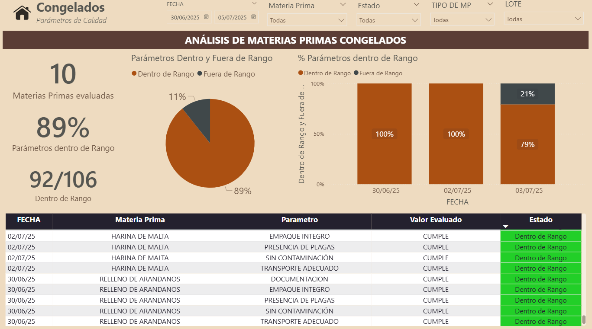

# 📊 Dashboard Estadístico Calidad Panovo - Power BI

Este repositorio contiene un ejemplo real de implementación de una solución en SharePoint orientada al control y análisis de materias primas en el área de Calidad. 

---

## 📌 Objetivo

Desarrollar un tablero en Power BI que permita visualizar y dar seguimiento a la evaluación diaria de todas las materias primas, facilitando el análisis de tendencias, la identificación de desviaciones y la toma oportuna de decisiones para asegurar la calidad y consistencia en el suministro de insumos.

---

## 🛠️ Tecnologías Utilizadas

- Power BI Desktop (DirectQuery)
- Sharepoint (Consultas a vistas y tablas en producción)
- DAX (Medidas complejas para disponibilidad, eficiencia, forecast, etc.)
- GitHub (para control de versiones y documentación técnica)

---

## 📁 Estructura del Repositorio

```plaintext
Estadistico-Calidad/
├── pbix/                                   → Archivo PBIX del tablero
├── README.md                               → Descripción general del repositorio
├── docs/
│   ├── MedidasDAX.md                          → Medidas DAX documentadas
│   ├── ColumnasCalculadas.md              → DAX documentadas
│   ├── Tablas_Dax.md                   → DAX documentadas
│   └── Instructivo Dashboard OEE.docx      → Guía de uso del dashboard
├── img/
│   ├── preview_dashboard.png               → Captura del dashboard
│   └── Modelo_Datos.png                    → Relación entre tablas
```

---

## 📷 Preview del Dashboard



---

## 📎 Cómo utilizarlo

1. Clona este repositorio.
2. Abre el archivo `pbix/DA_TarimasCHEP` con Power BI Desktop.
3. Conecta tu fuente de datos o consulta en SQL Server.
4. Revisa la documentación en `/docs` para entender cada fórmula y estructura.

---
